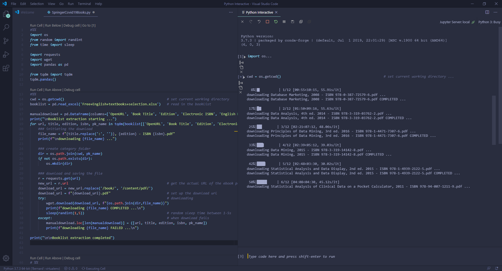

# Springer eBook Download

On April 2, 2020, in the midst of Covid-19 environment, Springer Nature is launching a global program to support learning and teaching at higher education institutions worldwide by giving access to more than 500 textbooks across Springer Nature's eBook subject collections.

This books will be made [available](https://www.springernature.com/gp/librarians/news-events/all-news-articles/industry-news-initiatives/free-access-to-textbooks-for-institutions-affected-by-coronaviru/17855960) at least until the end of July, 2020.

### Springer COVID-19 Books.py

Looking at the book list, there are already a couple of textbooks that caught my attention. While I can download a books individually by navigating to their respective download links, to save time, I wrote up {SpringerCovid19Books.py} to help me easily download the selection of Springer books made available free of charge during the COVID-19 circuit breaker and sort them into their respective category. 

*Springer COVID-19 Books.py running on VSCode*

### Deployment of UI
In one terminal, run start_ui.sh.

In another terminal, run start_flask.sh.

### Future Works

- [ ] Add the options to download ePUB of the books.
- [ ] Allow for download to resume if it's stopped halfway. Currently, if the code is executed again, the download start from scratch.
- [ ] Add the possibility to download specific edition of a book.
- [ ] Allow for downloading by topics. Currently user has to filter the book list before downloading.

### Acknowledgement

- Springer, for allowing us to continue learning, by offering many of their excellent books for free in this challenging time when we are stuck at home.